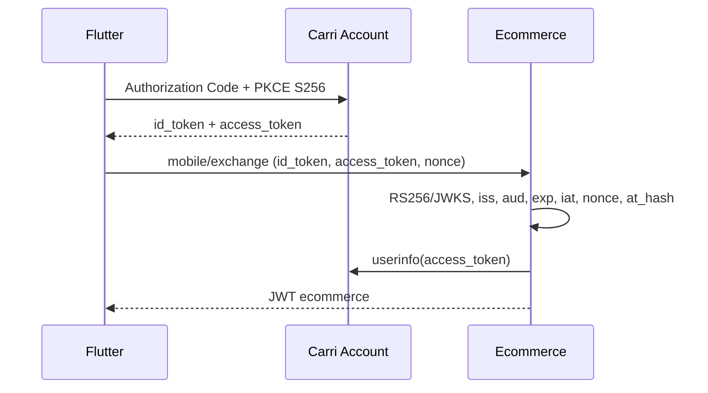

# Authentication

Carri Account gère identité, inscription, mots de passe, consentement OAuth et preuves OIDC. Ecommerce gère CarriIdentity, validation OIDC, sessions ecommerce et autorisation métier.

`CarriIdentity` conserve `carri_subject` (le claim `sub`, unique et stable), une
projection de l'adresse Carri vérifiée et les dates d'observation de `userinfo`
et de `auth_time`. L'e-mail n'est jamais une clé d'identité et n'a pas de
contrainte d'unicité globale.

## Android

Android est public, sans secret; state et nonce sont obligatoires. Flutter doit
demander `openid email`. Une adresse transmise directement par Flutter n'est
jamais une preuve. `IDTokenReplay` conserve le hash d'une preuve acceptée
jusqu'à `exp`.

## Web

Le backend demande `openid email`, utilise Authorization Code + PKCE, garde
state hashé, nonce et verifier dans `OAuthLoginAttempt`, puis renvoie un handoff
opaque et à usage unique. Les JWT ecommerce ne passent jamais dans une URL.

Discovery est obtenu via `{issuer}/.well-known/openid-configuration`; les endpoints et JWKS ne sont pas codés en dur. Validation : RS256, kid, signature, iss, aud, exp, iat, sub, nonce, nbf/azp si présents et at_hash.

Après validation de l'ID token, le backend appelle `userinfo` avec l'access
token lié par `at_hash`. Il exige `userinfo.public_id == sub`, un booléen
`email_verified` strictement égal à `true` et une adresse valide, ensuite
normalisée par `trim` + minuscules. Une réponse absente, incohérente ou une
erreur réseau interrompt l'authentification sans écraser une preuve antérieure.

La preuve destinée aux futures invitations est fraîche pendant 10 minutes. Le
contrôle porte séparément sur la date serveur d'observation de `userinfo` et
sur `auth_time`. Un JWT ecommerce ancien, ou une identité créée avant cette
projection, impose une nouvelle authentification Carri.

Les JWT ecommerce portent `identity_id`; EcommerceJWTAuthentication résout CarriIdentity. Variables : `CARRI_ACCOUNT_ISSUER`, `CARRI_ACCOUNT_CLIENT_ID`, `CARRI_ACCOUNT_CLIENT_SECRET`, `CARRI_ACCOUNT_REDIRECT_URI`, `CARRI_ACCOUNT_SCOPES`, `CARRI_ACCOUNT_ANDROID_CLIENT_ID`, `CARRI_ACCOUNT_ANDROID_REDIRECT_URI`, `CARRI_ACCOUNT_DISCOVERY_CACHE_SECONDS`, `CARRI_ACCOUNT_JWKS_CACHE_SECONDS`, `CARRI_ACCOUNT_ID_TOKEN_CLOCK_SKEW_SECONDS`, `CARRI_ACCOUNT_EMAIL_PROOF_MAX_AGE_SECONDS`.

Aucun token ou secret ne doit être loggé ou versionné. La blacklist SimpleJWT n'est pas utilisée car l'identité n'est pas AUTH_USER_MODEL; une révocation ecommerce dédiée reste nécessaire avant production.

## Authentification applicative HMAC

En complément du JWT utilisateur, `EcommerceClientHMACMiddleware` identifie l'application appelante. Le contrat complet, les en-têtes, la chaîne canonique, les vecteurs de signature, la rotation des clés, les codes d'erreur et la politique de routes sont décrits dans [Authentification HMAC des clients applicatifs](hmac-authentication.md).

Points structurants :

- HMAC n'est **jamais** un substitut au JWT utilisateur ni aux permissions métier ;
- les secrets vivent uniquement dans l'environnement, jamais en base ni en dépôt ;
- la politique de routes dépend de la méthode et du chemin, jamais d'un en-tête déclaré par le client ;
- Flutter Android n'embarque aucun secret HMAC partagé et conserve JWT + PKCE S256 ;
- Next.js conserve le secret côté serveur dans son BFF et ne signe jamais depuis le navigateur ;
- le mode est `DISABLED`, `OBSERVATION` ou `ENFORCE`; l'activation locale vise
  uniquement `POST /api/v1/auth/carri/handoff/consume/`;
- le renouvellement `POST /api/v1/auth/token/refresh/` reste sans HMAC car il
  est partage avec les clients existants; sa protection requerra une separation
  BFF explicite.

## Flux par plateforme

| Plateforme | Authentification applicative | Stockage des secrets |
|---|---|---|
| Flutter Android | aucune signature HMAC ; JWT ecommerce + PKCE S256 | aucun secret embarqué |
| Next.js Web | HMAC côté serveur, signé par le BFF uniquement | variable d'environnement du serveur |
| Flutter Desktop | client public, aucune signature HMAC | aucun secret embarqué |

Toutes les variables HMAC sont listées dans [API](api.md#authentification-hmac-des-clients-applicatifs).
