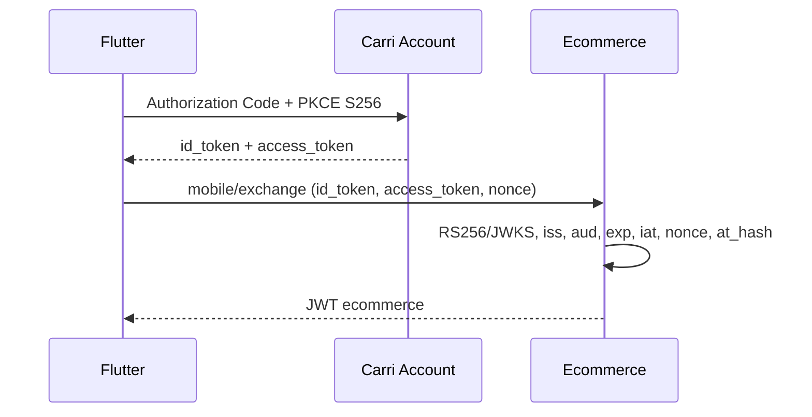

# Authentication

Carri Account gère identité, inscription, mots de passe, consentement OAuth et preuves OIDC. Ecommerce gère CarriIdentity, validation OIDC, sessions ecommerce et autorisation métier.

`CarriIdentity` contient `id`, `carri_subject` (le claim `sub`, unique et stable), `linked_at` et `last_login_at`. L'email n'est jamais une clé d'identité.

## Android

Android est public, sans secret; state et nonce sont obligatoires. `IDTokenReplay` conserve le hash d'une preuve acceptée jusqu'à `exp`.

## Web

Le backend utilise Authorization Code + PKCE, garde state hashé, nonce et verifier dans OAuthLoginAttempt, puis renvoie un handoff opaque et à usage unique. Les JWT ecommerce ne passent jamais dans une URL.

Discovery est obtenu via `{issuer}/.well-known/openid-configuration`; les endpoints et JWKS ne sont pas codés en dur. Validation : RS256, kid, signature, iss, aud, exp, iat, sub, nonce, nbf/azp si présents et at_hash.

Les JWT ecommerce portent `identity_id`; EcommerceJWTAuthentication résout CarriIdentity. Variables : `CARRI_ACCOUNT_ISSUER`, `CARRI_ACCOUNT_CLIENT_ID`, `CARRI_ACCOUNT_CLIENT_SECRET`, `CARRI_ACCOUNT_REDIRECT_URI`, `CARRI_ACCOUNT_ANDROID_CLIENT_ID`, `CARRI_ACCOUNT_ANDROID_REDIRECT_URI`, `CARRI_ACCOUNT_DISCOVERY_CACHE_SECONDS`, `CARRI_ACCOUNT_JWKS_CACHE_SECONDS`, `CARRI_ACCOUNT_ID_TOKEN_CLOCK_SKEW_SECONDS`.

Aucun token ou secret ne doit être loggé ou versionné. La blacklist SimpleJWT n'est pas utilisée car l'identité n'est pas AUTH_USER_MODEL; une révocation ecommerce dédiée reste nécessaire avant production.
