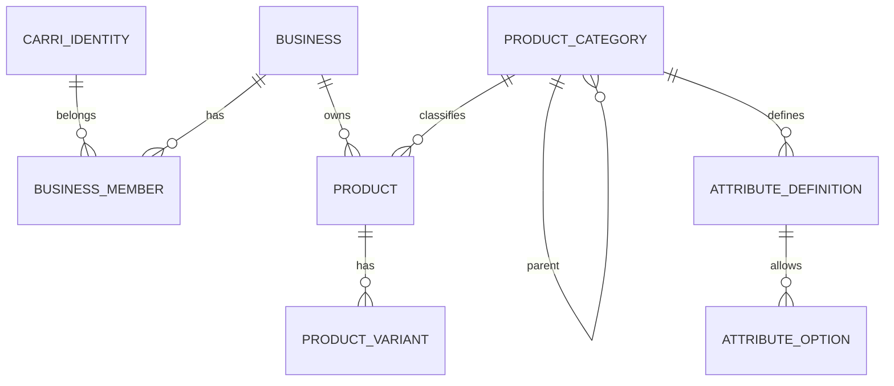

# Database

- **CarriIdentity** : PK UUID, `carri_subject` unique, projection minimale OIDC. Suppression protégée par les memberships.
- **OAuthLoginAttempt** : state hashé unique, nonce, verifier PKCE, expiration et consommation.
- **IDTokenReplay** : hash unique de preuve mobile et expiration.
- **OAuthHandoff** : hash unique, identité, expiration et consommation.
- **Business** : PK UUID, données opérationnelles, statut ACTIVE/SUSPENDED/ARCHIVED, devise CDF/USD.
- **BusinessMember** : PK UUID, FK protégées vers Business et CarriIdentity, unique `(identity, business)`, rôle OWNER/MANAGER/EMPLOYEE et statut ACTIVE/SUSPENDED. Le modèle refuse la suppression fonctionnelle du dernier OWNER actif.

## Public business identifiers and activity taxonomy

Business keeps its UUID for PostgreSQL relations but exposes immutable `public_id` as `SH` plus ten characters from `23456789ABCDEFGHJKLMNPQRSTUVWXYZ` (32^10 combinations). IDs use `secrets`; PostgreSQL UNIQUE remains authoritative and creation retries a bounded five times. Migration `0002` adds nullable IDs, backfills distinct values, then makes the column non-null.

BusinessCategory is the platform-controlled flat commerce taxonomy. BusinessCategoryMembership is the explicit relation, unique per Business/category; a conditional PostgreSQL constraint permits at most one `is_primary=True` membership per Business.

## Global product catalog

- **ProductCategory**: UUID PK; unique code and slug; optional globally unique `product_type_key`; protected parent relation; active flag and sort order. Model validation limits trees to three levels and rejects cycles.
- **AttributeDefinition**: UUID PK; protected category relation; unique `(category, code)`; typed active definition. A code cannot duplicate an ancestor's code.
- **AttributeOption**: UUID PK; protected definition relation; unique `(attribute_definition, value)`; active choice value.

## Tenant product catalog

- **Product**: UUID internal PK; indexed unique immutable `PR` public ID; protected FK to Business and ProductCategory; decimal selling/cost prices; CDF/USD; JSONB `attributes`; status and timestamps. `internal_reference` is conditionally unique per Business when non-null. Database checks reject negative prices.
- **ProductVariant**: UUID internal PK; indexed unique immutable `PV` public ID; protected FK to Product; JSONB attributes; SHA-256 `variant_signature`; optional decimal overrides and status. `(product, variant_signature)` is unique. Its SKU is conditionally unique per Product; service validation additionally protects the intended shared Business SKU namespace.
- **Barcode** is nullable and deliberately not unique. Neither table has a quantity or stock field.

## Inventory

- **InventoryItem**: UUID interne, index unique `IV`, FK protégée vers Business et exactement une FK protégée vers Product ou ProductVariant. Quantités `Decimal(14,3)`, seuil bas et timestamps. Contraintes PostgreSQL : XOR Product/Variant, unicité conditionnelle par Product/Variant, quantité/réservé/seuil non négatifs et `reserved_quantity <= quantity`.
- **StockMovement**: UUID interne, index unique `SM`, FK protégées vers Business, InventoryItem et CarriIdentity. Événement immuable avec type, delta, avant/après, motif et date. Les contraintes empêchent des snapshots négatifs.
