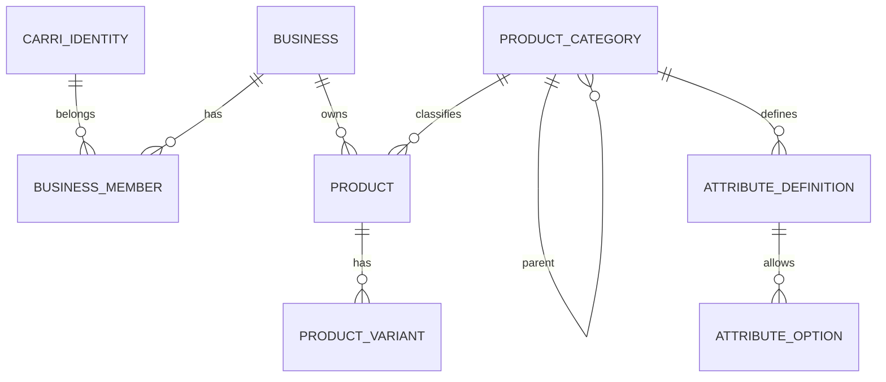

# Database

- **CarriIdentity** : PK UUID, `carri_subject` unique, projection minimale OIDC. Suppression protégée par les memberships.
- **OAuthLoginAttempt** : state hashé unique, nonce, verifier PKCE, expiration et consommation.
- **IDTokenReplay** : hash unique de preuve mobile et expiration.
- **OAuthHandoff** : hash unique, identité, expiration et consommation.
- **Business** : PK UUID, données opérationnelles, statut ACTIVE/SUSPENDED/ARCHIVED, devise CDF/USD.
- **BusinessMember** : PK UUID, FK protégées vers Business et CarriIdentity, unique `(identity, business)`, rôle OWNER/MANAGER/EMPLOYEE conservé comme donnée legacy, `is_owner` booléen, `title` descriptif et statut ACTIVE/SUSPENDED. Une contrainte conditionnelle garantit au plus un propriétaire par Business. Le modèle refuse la suspension, la perte de propriété et la suppression du propriétaire actif. Le service de création garantit qu'un nouveau Business en possède exactement un, actif, avec le titre `Gérant`.
- **BusinessMemberPermission** : PK UUID, FK vers BusinessMember, permission granulaire couvrant membres, configuration Business, moyens de paiement, catalogue, inventaire, achats, POS/ventes/retours, créances, dépenses, Finance, Dashboard, rentabilité et rapports; unique `(member, permission)`. L'OWNER n'a aucune ligne à maintenir car ses droits sont implicites. Un non-propriétaire ne reçoit aucune ligne automatiquement.

Les migrations `0005` et `0006` ajoutent d'abord la nouvelle structure, puis recopient explicitement les données legacy : OWNER devient propriétaire avec le titre `Gérant`, MANAGER reçoit seulement le titre `Gestionnaire`, EMPLOYEE le titre `Employé`. Aucun ancien MANAGER ne reçoit de permission. Si plusieurs anciens OWNER existent pour un même Business, la migration s'arrête explicitement au lieu d'en rétrograder un arbitrairement.

## Public business identifiers and activity taxonomy

Business keeps its UUID for PostgreSQL relations but exposes immutable `public_id` as `SH` plus ten characters from `23456789ABCDEFGHJKLMNPQRSTUVWXYZ` (32^10 combinations). IDs use `secrets`; PostgreSQL UNIQUE remains authoritative and creation retries a bounded five times. Migration `0002` adds nullable IDs, backfills distinct values, then makes the column non-null.

BusinessCategory is the platform-controlled flat commerce taxonomy. BusinessCategoryMembership is the explicit relation, unique per Business/category; a conditional PostgreSQL constraint permits at most one `is_primary=True` membership per Business.

## Global product catalog

- **ProductCategory**: UUID PK; unique code and slug; optional globally unique `product_type_key`; protected parent relation; active flag and sort order. Model validation limits trees to three levels and rejects cycles.
- **AttributeDefinition**: UUID PK; protected category relation; unique `(category, code)`; typed active definition. A code cannot duplicate an ancestor's code.
- **AttributeOption**: UUID PK; protected definition relation; unique `(attribute_definition, value)`; active choice value.

## Tenant product catalog

- **Product**: UUID internal PK; indexed unique immutable `PR` public ID; protected FK to Business and ProductCategory; decimal selling/cost prices; CDF/USD; JSONB `attributes`; status and timestamps. `internal_reference` is conditionally unique per Business when non-null. Database checks reject negative prices.
- **ProductVariant**: UUID internal PK; indexed unique immutable `PV` public ID; protected FK to Product; JSONB attributes; SHA-256 `variant_signature`; optional decimal overrides and status. `(product, variant_signature)` is unique. Its SKU is conditionally unique per Product; service validation additionally protects the intended shared Business SKU namespace.
- **Barcode** is nullable and deliberately not unique. Neither table has a quantity or stock field.

## Inventory

- **InventoryItem**: UUID interne, index unique `IV`, FK protégée vers Business et exactement une FK protégée vers Product ou ProductVariant. Quantités `Decimal(14,3)`, seuil bas et timestamps. Contraintes PostgreSQL : XOR Product/Variant, unicité conditionnelle par Product/Variant, quantité/réservé/seuil non négatifs et `reserved_quantity <= quantity`.
- **StockMovement**: UUID interne, index unique `SM`, FK protégées vers Business, InventoryItem et CarriIdentity. Événement immuable avec type, delta, avant/après, motif et date. Les contraintes empêchent des snapshots négatifs.

## Purchases

- **Supplier**: fournisseur Business, `SP` immuable.
- **Purchase**: `PU`, workflow DRAFT/CONFIRMED/RECEIVED/CANCELLED et auteurs horodatés.
- **PurchaseLine**: `PL`, Product XOR Variant, quantité positive, coût positif et total dérivé.

## Sales
Customer, Sale et SaleLine forment les ventes internes; SaleLine cible Product XOR Variant et conserve les snapshots.

## Receivables
Receivable est unique par Sale; ReceivablePayment est historique et immuable.

## Expenses

- **ExpenseCategory** : UUID interne, identifiant public immuable `EC`, FK protégée vers Business, code unique par `(business, code)`, catégorie système ou personnalisée, activation et ordre d'affichage.
- **Expense** : UUID interne, identifiant public immuable `EX`, FK protégées vers Business, ExpenseCategory et auteur. Le montant est strictement positif par contrainte PostgreSQL. La validation métier exige que la catégorie appartienne au même Business. Le workflow est `ACTIVE` puis éventuellement `CANCELLED`, avec audit d'annulation.

## Finance

- **FinancialMovement** : UUID interne, identifiant public immuable `FM`, FK protégées vers Business, auteur et une unique source métier (`Sale`, `ReceivablePayment` ou `Expense`), ou vers le mouvement original pour une correction. Le montant est positif; les contraintes SQL imposent une source unique, l’unicité d’une clé d’idempotence par Business et empêchent les doublons Sale/Expense par type d’événement. `receivable_payment` est un `OneToOneField`, ce qui garantit un seul mouvement pour un paiement de créance. Les règles de correspondance événement/source, de devise et de correction sont validées par le modèle et le service.

## Idempotence des paiements de créances

**ReceivablePayment** est immuable après création. Il stocke une clé d’idempotence facultative et l’empreinte SHA-256 du payload. Une contrainte unique conditionnelle `(business, idempotency_key)` protège les répétitions HTTP. Son mouvement Finance est déjà garanti unique par `FinancialMovement.receivable_payment` (`OneToOneField`).

## Expense payments

- **ExpensePayment** : UUID interne, identifiant public `EP`, FK protégée vers Expense et acteur, montant positif, PaymentMethod, horodatage, idempotence par `(expense, idempotency_key)` et métadonnées de reversal. Les valeurs monétaires sont immuables.
- **FinancialMovement.expense_payment** : relation unique vers le règlement réel. La FK `expense` historique est conservée pour compatibilité mais n’est plus admise comme source des nouveaux `EXPENSE_PAYMENT`.

- **SupplierPayment** : règlement immuable relié à Purchase, montant positif, moyen de paiement, idempotence par Purchase et métadonnées de reversal. `FinancialMovement.supplier_payment` est sa source financière unique.
