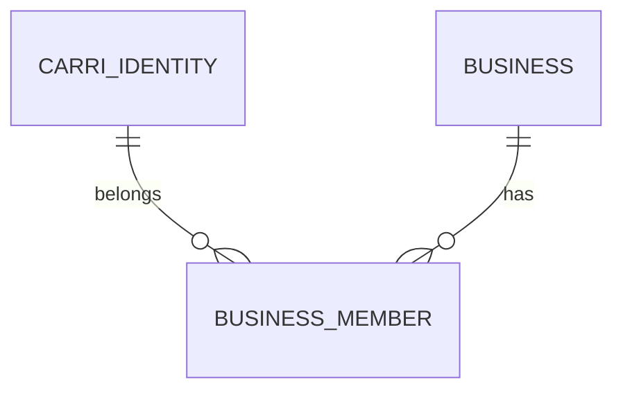

# Database

- **CarriIdentity** : PK UUID, `carri_subject` unique, projection minimale OIDC. Suppression protégée par les memberships.
- **OAuthLoginAttempt** : state hashé unique, nonce, verifier PKCE, expiration et consommation.
- **IDTokenReplay** : hash unique de preuve mobile et expiration.
- **OAuthHandoff** : hash unique, identité, expiration et consommation.
- **Business** : PK UUID, données opérationnelles, statut ACTIVE/SUSPENDED/ARCHIVED, devise CDF/USD.
- **BusinessMember** : PK UUID, FK protégées vers Business et CarriIdentity, unique `(identity, business)`, rôle OWNER/MANAGER/EMPLOYEE et statut ACTIVE/SUSPENDED. Le modèle refuse la suppression fonctionnelle du dernier OWNER actif.

## Public business identifiers and activity taxonomy

Business keeps its UUID for PostgreSQL relations but exposes immutable `public_id` as `SH` plus ten characters from `23456789ABCDEFGHJKLMNPQRSTUVWXYZ` (32^10 combinations). IDs use `secrets`; PostgreSQL UNIQUE remains authoritative and creation retries a bounded five times. Migration `0002` adds nullable IDs, backfills distinct values, then makes the column non-null.

BusinessCategory is the platform-controlled flat commerce taxonomy. BusinessCategoryMembership is the explicit relation, unique per Business/category; a conditional PostgreSQL constraint permits at most one `is_primary=True` membership per Business.
